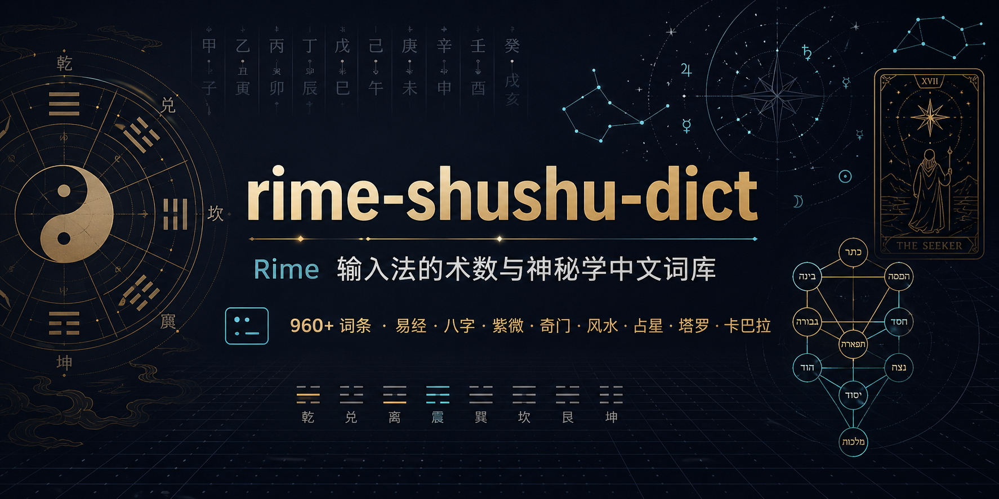

<div align="center">



# rime-shushu-dict

**一份适用于 [RIME 输入法](https://rime.im/) 的术数 / 神秘学中文词库**

覆盖中国传统命理、占卜、堪舆、道教民俗，以及西方占星、塔罗、炼金术、卡巴拉等内容

[简体中文](./README.md) · [English](./README.en.md)

[](https://creativecommons.org/licenses/by/4.0/)
[](https://rime.im/)
[](./shushu_mysticism.dict.yaml)
[](#词库内容)
[](https://github.com/misakaikato/rime-shushu-dict/stargazers)
[](https://github.com/misakaikato/rime-shushu-dict/issues)
[](https://github.com/misakaikato/rime-shushu-dict/commits/main)
[](#贡献指南)

</div>

---

## 特性

- **覆盖广**：约 960+ 词条，分 16 个大类，兼顾中西方神秘学体系。
- **易接入**：标准 Rime 词库格式（`*.dict.yaml`），可单独使用或合并到自定义词库。
- **方案通用**：基于汉语拼音编码，适用于 [雾凇拼音](https://github.com/iDvel/rime-ice)、[小鹤双拼](https://github.com/rime/rime-double-pinyin)、[明月拼音](https://github.com/rime/rime-pinyin-simp) 等绝大多数拼音系方案。
- **含异读容错**：对常见多音字（如 卜筮 `bu shi` / `bo shi`）、生僻字（巽、艮、噬嗑、贲、睽、蹇、夬、姤）、外来译名（阿卡纳 / 阿尔克那、卡巴拉 / 喀巴拉）等设有备选编码，减少候选漏出。
- **可选符号挂载**：附带 OpenCC 符号映射，输入 乾卦 / 水火既济 / 摩羯座 等词条时可直接上屏 ☰ / ䷾ / ♑ 等 Unicode 符号，详见 [符号挂载](#方法三emoji--符号挂载可选)。

## 词库内容

| 分类 | 示例词条 |
|------|----------|
| 总类 | 术数、玄学、命理、阴阳五行、河图、洛书、太极、四象 |
| 易经与八卦 | 周易、十翼、卦象、爻辞、先后天八卦、六十四卦卦名 |
| 天干地支与六十甲子 | 十天干、十二地支、六十甲子、刑冲合害破 |
| 纳音 | 海中金、炉中火、大林木 等六十纳音 |
| 八字命理 | 四柱、十神、大运、流年、用神、格局、神煞 |
| 神煞 | 天乙贵人、文昌、桃花、华盖、驿马、空亡 等 |
| 六爻、梅花与占法 | 京房易、纳甲、世应、用神、梅花易数、断卦术语 |
| 奇门遁甲 | 三奇六仪、九星八门、值符值使、阳遁阴遁 |
| 紫微斗数 | 十四主星、宫位、四化、三方四正 |
| 风水堪舆 | 形峦理气、三元九运、玄空飞星、二十四山、罗盘 |
| 择日与黄历 | 黄道吉日、建除十二神、二十八宿值日、宜忌 |
| 星宿、道教与民俗神明 | 二十八宿、三清四御、八仙、文昌帝君、土地公 |
| 西方占星 | 十二星座、十大行星、十二宫位、相位、回归星盘 |
| 塔罗 | 大阿卡纳、小阿卡纳、四元素、宫廷牌、韦特塔罗 |
| 西方神秘学、炼金术与卡巴拉 | 生命之树、十质点、四世界、贤者之石、玫瑰十字 |
| 常见异读与容错 | 卜筮、噬嗑、觜宿、阿卡纳、卡巴拉 等多音及译名 |

## 安装与使用

### 方法一：作为独立词库

1. 将 `shushu_mysticism.dict.yaml` 放入 Rime 用户目录：

	- macOS：`~/Library/Rime/`
	- Windows：`%APPDATA%\Rime\`
	- Linux：`~/.config/ibus/rime/` 或 `~/.config/fcitx/rime/`

2. 在你正在使用的方案文件（如 `rime_ice.custom.yaml` 或 `luna_pinyin.custom.yaml`）中挂载该词库：

	```yaml
	patch:
	  "translator/dictionary": rime_ice
	  "translator/prism": rime_ice
	  "schema/dependencies":
	    - shushu_mysticism
	```

	或者直接在主词库（如 `rime_ice.dict.yaml`）的 `import_tables` 中追加：

	```yaml
	import_tables:
	  - shushu_mysticism
	```

3. 重新部署（菜单中选择「重新部署」或运行 `rime_deployer --build`）。

### 方法二：合并到现有词库

直接将 `shushu_mysticism.dict.yaml` 中 `---` / `...` 之后的词条段落，粘贴到你自定义词库的对应位置，重新部署即可。

### 方法三：Emoji / 符号挂载（可选）

通过 OpenCC 过滤器为词条挂载对应的 Unicode 符号：输入 `qiangua`，候选中除「乾卦」外还会出现「☰」，空格照常上屏汉字，按对应数字键即可上屏符号。

覆盖 128 条映射：太极 ☯、阴阳爻与四象 ⚊⚋⚌⚍⚎⚏、八卦 ☰–☷、六十四卦（全名及 既济 / 中孚 / 归妹 等两字卦名）䷀–䷿、十二星座 ♈–♓、十大行星 ☉☽☿♀♂♃♄♅♆♇、南北交点 ☊☋ 与凯龙星 ⚷。

1. 将 [opencc/shushu_symbols.txt](./opencc/shushu_symbols.txt) 与 [opencc/shushu_symbols.json](./opencc/shushu_symbols.json) 放入 Rime 用户目录下的 `opencc/` 文件夹（没有就新建）。

2. 在你正在使用的方案 custom 文件（如 `rime_ice.custom.yaml`）中追加开关与过滤器：

	```yaml
	patch:
	  switches/+:
	    - name: shushu_symbols
	      states: [ 卦符关, 卦符开 ]
	      reset: 1
	  engine/filters/+:
	    - simplifier@shushu_symbols
	  shushu_symbols:
	    opencc_config: shushu_symbols.json
	    option_name: shushu_symbols
	    tips: all
	    inherit_comment: false
	```

3. 重新部署。

默认开启，可在方案菜单（<kbd>F4</kbd> 或 <kbd>Ctrl</kbd>+<kbd>`</kbd>）中随时关闭。与 [雾凇拼音](https://github.com/iDvel/rime-ice) 自带的 emoji 挂载互不冲突，可同时启用。

## 词频说明

词条权重（第三列）参考使用频率与专业度设置，范围大致在 7000–10000：

- `10000` 级：核心高频词（如 术数、五行、八卦、易经）
- `9000` 级：常用专业术语
- `8000` 级：进阶 / 专门词汇
- `7000` 级：较冷僻或学派内部用语

可按个人需求自行调整权重。

## 贡献指南

🎉 **欢迎任何形式的贡献！** 无论你是命理爱好者、Rime 用户，还是路过的开发者，都可以参与共建：

### 你可以做什么

- 🔤 **补充词条**：缺失的术语、流派专用语、地方异写
- 🐛 **修正错误**：拼音、字形、权重、分类不当
- 🔁 **添加容错**：多音字、繁简、异体、常见误读、外来译名
- 📚 **完善文档**：使用说明、安装步骤、方案适配
- 🌐 **翻译协作**：英文版及其他语种 README

### 提交流程

1. Fork 本仓库 → 创建你的分支：`git checkout -b feat/add-xxx`
2. 按现有格式追加词条（注意分类位置）：
	```
	词条<TAB>拼音（小写、空格分隔）<TAB>权重（整数）
	```
3. 提交：`git commit -m "feat: 增加 xxx 类词条"`
4. 推送：`git push origin feat/add-xxx`
5. 提交 [Pull Request](https://github.com/misakaikato/rime-shushu-dict/pulls)

### 贡献准则

- 词条尽量保持**专业准确**，避免网络戏称、自创术语
- 拼音以 **现代汉语词典 / 普通话审音表** 为准；存在异读时分别列入「异读与容错」类
- 权重在区间内**相对合理**即可，不必精确比较
- 大批量改动建议**先开 Issue 讨论**

也欢迎通过 [Issues](https://github.com/misakaikato/rime-shushu-dict/issues) 反馈意见、报告错误或提出建议 ✨

## 致谢

- [Rime 输入法引擎](https://github.com/rime/librime)
- [雾凇拼音](https://github.com/iDvel/rime-ice) 等优秀开源方案

## 许可

本词库以 [CC BY 4.0](https://creativecommons.org/licenses/by/4.0/) 协议发布，使用时请保留出处。

---

<div align="center">

如果这个词库对你有帮助，欢迎点亮一颗 ⭐ Star —— 这是对作者最大的鼓励！

</div>

---

## Consulting & Custom Development · 咨询与定制开发

**EN** — Available for freelance and consulting work: custom features or integrations for this project, local LLM / TTS / ASR deployment on Apple Silicon (MLX), and full-stack development in TypeScript, Python, and Rust.

**中文** — 可提供咨询与定制开发：本项目的定制功能与集成、Apple Silicon 上的本地大模型 / 语音合成 / 语音识别部署（MLX），以及 TypeScript、Python、Rust 全栈开发。

Contact · 联系方式：[misakaikato@outlook.com](mailto:misakaikato@outlook.com)
